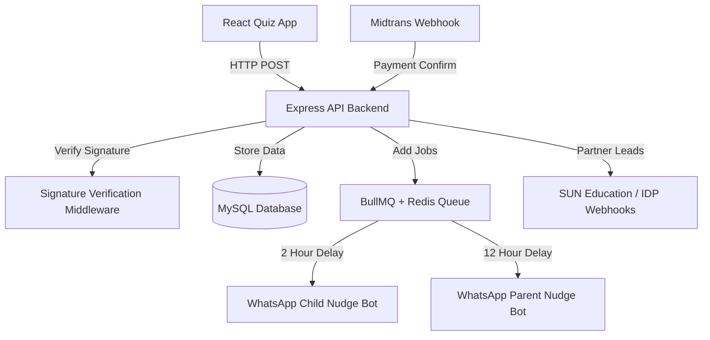

# Implementation Plan: Node.js Express API & BullMQ Nudge Backend

This plan details the construction of the Node.js / Express API and queue backend for **Avra Kedavra (AVRA)** to support the React Quiz app and the B2C Parent-to-Child WhatsApp bridge funnel.

---

## Proposed Architecture

---

## Proposed Changes

We will create a backend application inside our workspace at `C:\Users\WELCOME\.gemini\antigravity\scratch\avra\backend`.

### 1. Database Connection Layer
#### [NEW] [database.js](file:///C:/Users/WELCOME/.gemini/antigravity/scratch/avra/backend/config/database.js)
Establish a connection pool using `mysql2` connecting to the local MySQL server.
The schema maps tables matching the original Laravel migrations:
*   `student_isca_codes` (code validation and status tracking)
*   `student_isca_tests` (contains mbti_result, riasec_result, learning_style, top_trait, disc)
*   `student_isca_free_reports` & `student_isca_free_report_items` (teaser data)
*   `student_isca_paid_reports` & `student_isca_paid_report_items` (full data)
*   `student_riasec_test_results`, `student_mbti_test_results`, `student_disc_test_results`, `student_learning_style_test_results`, `student_trait_test_results` (factor scores)
*   `students` (user profile data, phone numbers)

### 2. Cryptographic Security Middleware
#### [NEW] [signature.js](file:///C:/Users/WELCOME/.gemini/antigravity/scratch/avra/backend/middleware/signature.js)
Verify request signatures using HMAC-SHA256 on the payload.
*   **Formula:** `hash_hmac('sha256', timestamp + '.' + payload, secret)`
*   Matches the frontend `generateSignature(userCode, timestamp)` helper to prevent request spoofing.

### 3. Psychometric Scoring Service
#### [NEW] [scoring.js](file:///C:/Users/WELCOME/.gemini/antigravity/scratch/avra/backend/services/scoring.js)
Algorithm to calculate:
*   **RIASEC:** Summarizes scores for Realistic, Investigative, Artistic, Social, Enterprising, and Conventional, sorting to return the top 3 letters (e.g., "SEC").
*   **MBTI:** Compares pairs (E vs I, S vs N, T vs F, J vs P) and returns the 4-letter type.
*   **DISC:** Maps Dominance, Influence, Steadiness, and Compliance scores.
*   **VAKS Learning Style:** Calculates percentage values for Visual, Auditory, and Kinesthetic.
*   **16PF Primary Traits:** Maps Warmth, Reasoning, Stability, Liveliness, Rule-Consciousness, etc.

### 4. BullMQ Auto-Nudge Queue System
#### [NEW] [nudgeQueue.js](file:///C:/Users/WELCOME/.gemini/antigravity/scratch/avra/backend/queues/nudgeQueue.js)
Initialize BullMQ with a Redis connection to handle delayed WhatsApp bridge notifications:
*   **Job 1 (Nudge-Child):** Initiated with a 2-hour delay when a code is generated or validated. Sends a WhatsApp nudge if the test is still in progress.
*   **Job 2 (Nudge-Parent):** Initiated with a 12-hour delay. Nudges the parent if the child has not finished the quiz.
*   **Cancellation on Complete:** Once `POST /submit-test` is successfully called, the active nudge jobs for the student's code are canceled.

### 5. API Router
#### [NEW] [server.js](file:///C:/Users/WELCOME/.gemini/antigravity/scratch/avra/backend/server.js)
Define endpoints matching `IscaController.php`:
*   `POST /api/isca/get-isca-result` -> Check access code and load student details.
*   `POST /api/isca/submit-test` -> Store raw scores, calculate psychometrics, cancel nudges.
*   `POST /api/isca/submit-free-report` -> Store AI-generated free teaser reports.
*   `POST /api/isca/submit-paid-report` -> Store full report markdown contents.
*   `POST /api/isca/get-subscription-plan` -> Return pricing plan detail.
*   `POST /api/isca/subscription-plan` -> Create Midtrans checkout URL.
*   `POST /api/isca/checking-pending-consultation` -> Calendly checking.
*   `POST /api/payment/midtrans-callback` -> Webhook handling payment callbacks, updating `already_paid_report` flag, and pushing lead referral payloads to SUN Education / IDP.

---

## Verification Plan

### Automated Tests
We will write Node.js mocha/chai tests under `backend/tests/` to verify:
1.  **HMAC Signature Verification:** Tests invalid signatures are rejected with `400 Bad Request`.
2.  **Scoring Logic Accuracy:** Compares sample score datasets against expected MBTI/RIASEC letters.
3.  **BullMQ Scheduler:** Verifies jobs are queued on Redis and canceled on completion.

### Manual Verification
1.  **Run Server:** Run `node server.js` locally on port 8000.
2.  **API Integration:** Direct the copied `quiz-app` `.env` or `env.ts` to `http://localhost:8000/api/isca`.
3.  **Walkthrough:** Complete a mock quiz in the browser, verify data is stored in the database, and verify logs show the WhatsApp nudges were scheduled and successfully canceled.
